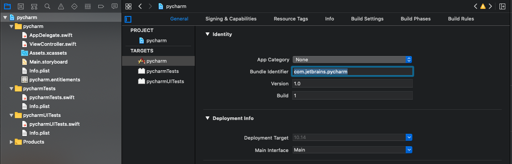
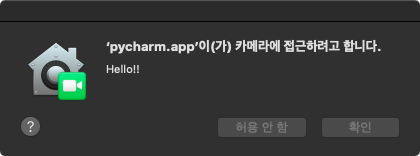
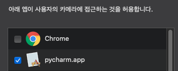

# How To Use
## Step 1 : Clone Repo
```bash
git clone https://github.com/mansuiki/PycharmCamFix
```

## Step 2 : Get Pycharm Bundle ID
```bash
osascript -e 'id of app "Pycharm"'
# Example Output : com.jetbrains.pycharm

# Other APP : osascript -e 'id of app "APP_NAME"'
# Like : osascript -e 'id of app "Visual Studio Code"'
```

## Step 3 : Set Xcode APP Bundle ID


## Step 4 : Build App & Run


## Step 5 : Close App & Check


## Step 6 : Check Pycharm
```python
# Example.py
import cv2 as cv

cap = cv.VideoCapture(0)

while True:
    ret, frame = cap.read()
    cv.imshow("cam", frame)
    if cv.waitKey(5) == ord('q'):
        break

cv.destroyAllWindows()
cap.release()
```
