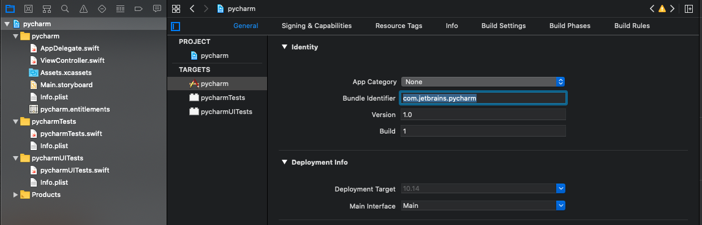
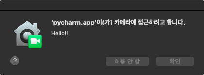
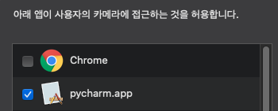

## Tutorial - With Example
### Step 1 : Clone Repo
```bash
git clone https://github.com/mansuiki/PycharmCamFix
```

### Step 2 : Find Bundle ID
```bash
# 
# This command will print out the `Target Application Bundle ID`.
osascript -e 'id of app "NAME OF TARGET APPLICATION"'

# EXAMPLE
osascript -e 'id of app "Pycharm"'
# OUTPUT
com.jetbrains.pycharm
```

### Step 3 : Open Xcode Project & Set Xcode APP Bundle ID
1. Select Project in project navigator
2. Select General and edit `Bundle Identifier` to `Target Application Bundle ID`


### Step 4 : Build App & Run


### Step 5 : Close App & Check


### Step 6 : Run Example Code in Pycharm
```python
# Example.py
import cv2 as cv

cap = cv.VideoCapture(0)

while True:
    ret, frame = cap.read()
    cv.imshow("cam", frame)
    if cv.waitKey(5) == ord('q'):
        break

cv.destroyAllWindows()
cap.release()
```