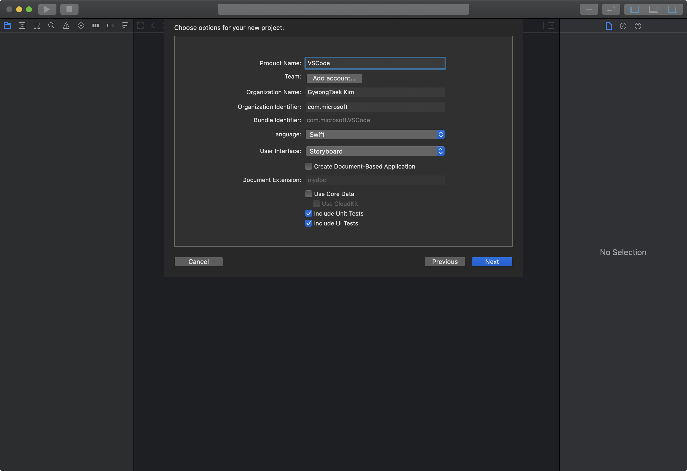
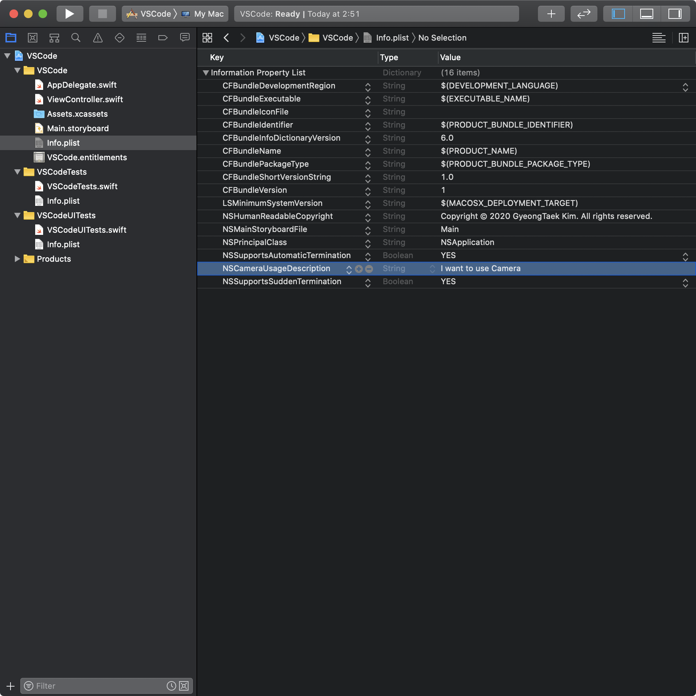
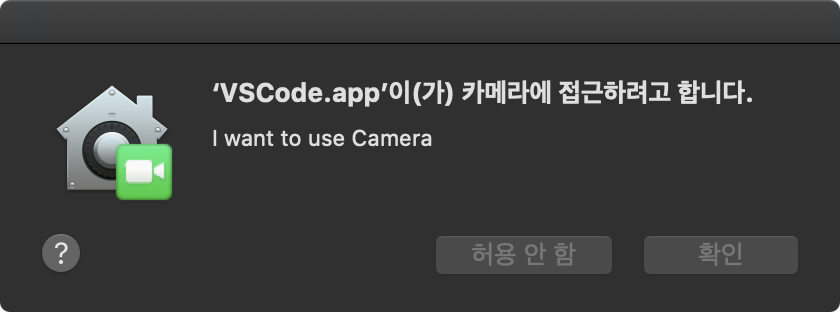
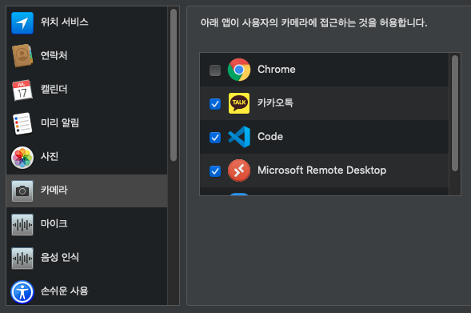
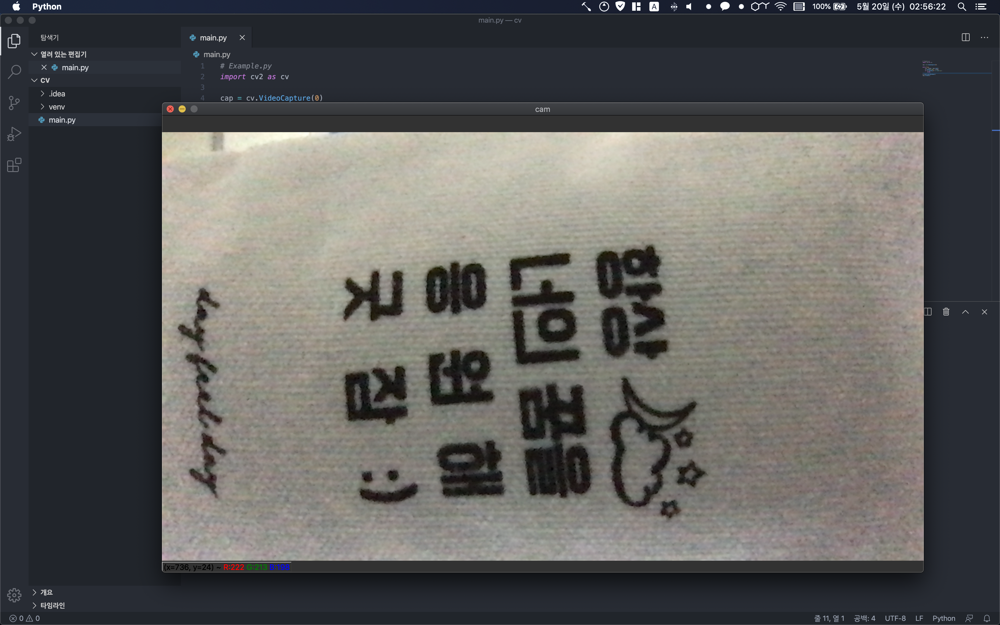

## Tutorial - Without Example
This Tutorial will Grant Camera Permission to `Visual Studio Code`
### Step 1 : Find Bundle ID
```bash
# 
# This command will print out the `Target Application Bundle ID`.
osascript -e 'id of app "NAME OF TARGET APPLICATION"'

# EXAMPLE
osascript -e 'id of app "Visual Studio Code"'
# OUTPUT
com.microsoft.VSCode
```

### Step 2 : Make new Xcode Project & Edit Bundle ID
1. Open Xcode
2. `FILE > NEW > PROJECT > macOS > App` // Make new Project
3. Set `Product Name` with last part of Bundle ID ( Example :: `VSCode` )
4. Set `Organization Identifier` with other part of Bundle ID ( Example :: `com.microsoft`)
5. Set `User Interface` to `Storyboard`




### Step 3 : Edit Info.plist
1. Open `Info.plist`
2. `Right-click > Check "Raw Keys & Values" > "Add Row"`
3. KEY : `NSCameraUsageDescription` , Value : `I want to use Camera`



### Step 4 : Write Code
[Requesting Authorization for Media Capture on macOS](https://developer.apple.com/documentation/avfoundation/cameras_and_media_capture/requesting_authorization_for_media_capture_on_macos)
1. Open `ViewController.swift`
2. Write Code

```swift
// ViewController.swift
import Cocoa
import AVFoundation // ADDED

class ViewController: NSViewController {

    override func viewDidLoad() {
        super.viewDidLoad()
        AVCaptureDevice.requestAccess(for: .video) { _ in } // ADDED
        // Do any additional setup after loading the view.
    }

    override var representedObject: Any? {
        didSet {
        // Update the view, if already loaded.
        }
    }
}
```

### Step 5 : Run & Check


